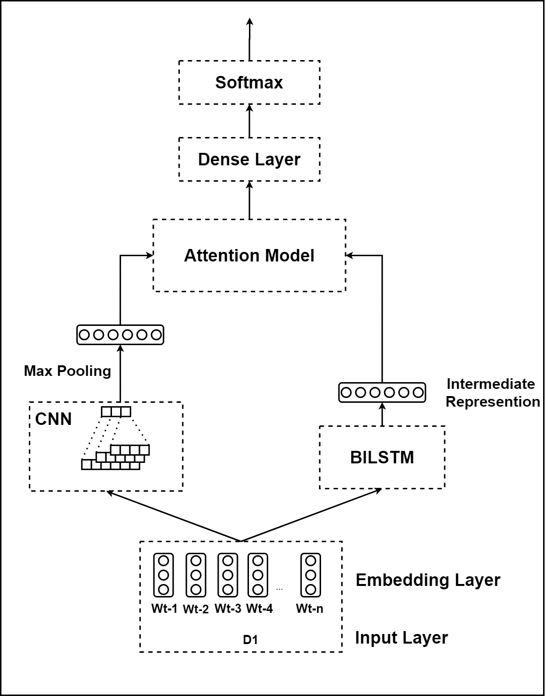

# Technical-Domain-Identification
* The repository contains team **SPPU_AKAH's submission** for the **ICON 2020 TechDOfication Shared Task (Subtask-1f)**. We propose a **Hybrid CNN-BiLSTM Attention Ensemble model** for the task of coarse-grained automatic technical domain identification of short texts in the Marathi Language.
* Experimental results show that our Hybrid CNN-BiLSTM Attention Ensemble Model outpeforms various baseline machine learning and deep learning models in the given task, giving the best validation accuracy of 89.57% and f1-score of 0.8875. 
* Furthermore, the solution resulted in the **best system submission for the Subtask-1f**, giving a test accuracy of 64.26% and f1-score of 0.6157, transcending the performances of other teams as well as the baseline system given by the organizers of the shared task.
* Link to ICON 2020 conference website [(click here)](https://www.iitp.ac.in/~ai-nlp-ml/icon2020/index.html).
* Link to the TechDOFication-2020 Shared Task website [(click here)](https://ssmt.iiit.ac.in/techdofication.html).

# Repository Overview:
* The **classifiers** folder contains the code of all the proposed models as well as the data preprocessing model.
* The **dataset** folder contains the training, validaiton, and test(blind) dataset.
* the **embeddings** folder contains the code to train the fasttext embddings.
* The **tokenizer** folder contains the tokenizers used for the ML and DL models.
* The **models** folder contains the architecture and weight of all the proposed models.
* The **results** folder contains the Shared-Task Submission files.

# The Dataset:
* The Subtask-1f dataset consisted of 4 labels namely: 
  * Bio-Chemistry (bioche)
  * Communication Technology (com_tech)
  * Computer Science (cse)
  * Physics (phy).
* The dataset can be downloaded from the Shared Task's website. The training and validation split is as follows:

|Label|Training Data|Validation Data|
|:-------|:--------|:-------|
|Bio-Chemistry (bioche)|5,002|420|
|Communication Technology (com_tech)|17,995|1,505|
|Computer Science (cse)|9,344|885|
|Physics (phy)|9,656|970|
|**Total**|**41,997**|**3780**|

# Proposed Model:
* We propose a **Hybrid CNN-BiLSTM Attention Ensemble Model** for the task of Technical Domain Identification.
* The the proposed model hypothesizes a potent way to subsume the advantages of both the CNN and the BiLSTM using the attention mechanism.
* The model employs a parallel structure where both the CNN and the BiLSTM model the input sentences independently. The intermediate representations, thus generated, are combined using the attention mechanism. 
* Therefore, the generated vector has useful temporal features from the sequences generated by the BiLSTM according to the context generated by the CNN. Results attest that the proposed model outperforms various baseline machine learning and deep learning models in the given task, giving the best validation accuracy and f1-score.
* The architecture of the proposed model is shown below:

# Performance comparison of different models:

|Model|Input Features|Validation Accuracy|Average F1-Score|
|:-------|:--------|:-------|:--------|
|Multinomial Naive Bayes|
BoW char-BoW TF-IDF n-gram TF-IDF character n-gram TF-IDF
|
86.74 81.61 77.16 61.98 76.93
|
0.8532 0.8010 0.7251 0.5138 0.7329
|
|Linear SVC|
BoW char-BoW TF-IDF n-gram TF-IDF character n-gram TF-IDF Indic-fasttext embeddings(mean) Indic-fasttext embeddings(TF-IDF) Domain-Specific fasttext Embeddings(mean) Domain-Specific fasttext Embeddings(TF-IDF)
|
85.76 86.19 88.17 87.27 88.78 79.20 77.67 85.44 85.42
|
0.8435 0.8467 0.8681 0.8614 0.8757 0.7691 0.7513 0.8419 0.8414
|
|FFNN|
fasttext embeddings Indic-fasttext embeddings Domain specific fasttext embeddings
|
59.39 71.50 76.11
|
0.4475 0.6929 0.7462 0.7454
|
|CNN|
fasttext embeddings Indic-fasttext embeddings Domain specific fasttext embeddings
|
72.59 77.08 86.66
|
0.7024 0.7514 0.8312 0.8532
|
|Bi-LSTM|
fasttext embeddings Indic-fasttext embeddings Domain specific fasttext embeddings
|
80.00 83.12 89.31
|
0.7870 0.8215 0.8629 0.8842
|
|BiLSTM-CNN|Domain specific fasttext embeddings|88.99|0.8807|
|BiLSTM-Attention|Domain fasttext specific embeddings|88.14|0.8697|
|Serial BiLSTM-CNN + Attention|Domain fasttext specific embeddings|88.23|0.8727|
|**Enemble CNN-BiLSTM + Attention**|**Domain fasttext specific embeddings**|**89.57**|**0.8875**|

# Performance of the proposed model on the valdiaton data:

|Metrics|bioche|com_tech|cse|phy|
|:-------|:--------|:-------|:--------|:--------|
|Precision|0.9128|0.8831|0.9145|0.8931|
|Recall|0.7976|0.9342|0.8949|0.8793|
|F1-Score|0.8513|0.9079|0.9046|0.8862|

# Performance Comparison with other teams:

|Team|Accuracy|Precision|Recall|F1-Score|
|:-------|:--------|:-------|:--------|:--------|
|CUETNLP|0.2874|0.1894|0.1690|0.1678|
|CONCORDIA_CIT|0.2522|0.2441|0.2346|0.2171|
|Butterflies|0.4910|0.4956|0.4826|0.4443|
|fineapples|0.5|0.5029|0.4906|0.4545|
|NLP@CUET|0.6308|0.6598|0.6138|0.5980|
|TechdoOne|0.6308|0.6337|0.6185|0.5989|
|Organizer’s System|0.6414|0.6576|**0.6297**|0.6141|
|**SPPU_AKAH**|**0.6426**|**0.6729**|0.6244|**0.6157**|
